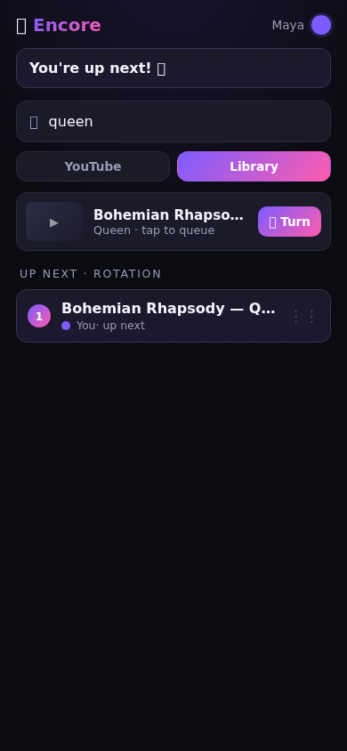
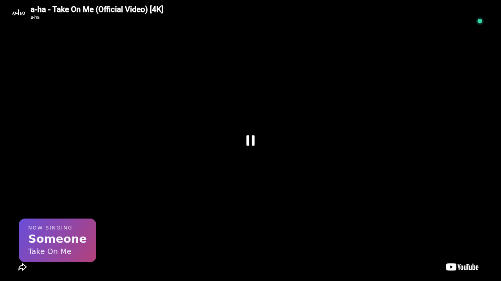

# 🎤 Encore

Self-hosted karaoke that's **mobile-first, wicked fast, and cleaner than any incumbent**.
Scan a QR, queue from YouTube or your library, and sing — with round-robin fairness, a
gapless TV, and live "make-karaoke" stem separation on the roadmap.

> **v0.1.0 (MVP)** — YouTube + local search, real-time round-robin queue, two-surface
> phone+TV with gapless playback. One container. Full design in
> [`docs/MASTER-DESIGN.md`](docs/MASTER-DESIGN.md).

## ✨ What it does today

- **📱 Phone remote** — scan to join (name + color, no signup), search YouTube/Library,
  one-tap queue, drag-reorder your picks, remove+undo, now-playing controls.
- **📺 TV/stage** — join QR attract screen, gapless two-player video, "Now singing"
  lower-third, "Next up" interstitial.
- **Round-robin rotation** — everyone's 1st pick before anyone's 2nd; new joiners slot in fairly.
- **Real-time + optimistic** — every tap renders instantly; 20 phones stay synced over flaky
  wifi; reconnects self-heal.

| Phone remote | TV stage |
|---|---|
|  |  |

## 🚀 Quickstart

**Docker (one container — the whole MVP):**
```bash
docker compose up            # build + run core on http://localhost:3000
# open http://localhost:3000/tv on the big screen, scan the QR with phones
```

**Local dev (Bun):**
```bash
bun install                  # installs workspaces (uses public npm via repo .npmrc)
cd apps/core
bun run build && bun run start   # prod build + serve on :3000
# or: bun run dev                # vite dev server (UI HMR; WS hub needs the built server)
```

Then: open **`/tv`** on a TV/laptop, **scan the QR** with phones → search → queue → sing.

## Stack

**Bun** runtime · **SvelteKit + Svelte 5 (PWA)** · **`Bun.serve` native WebSocket pub/sub** ·
**`bun:sqlite` (WAL) + Drizzle** · in-memory authoritative state · bundled **yt-dlp + ffmpeg**.
One container for the MVP; a Python **Demucs + WhisperX** worker joins (container 2) for stems.
See [`docs/MASTER-DESIGN.md`](docs/MASTER-DESIGN.md) §2a.

> **YouTube search** uses keyless `yt-dlp` (bundled in the Docker image). In bare local dev
> without yt-dlp on PATH, YouTube search returns empty and the **Library** tab still works.

## Layout

```
packages/shared/   ← the realtime contract, made physical (imported by client AND server)
apps/core/         ← Container 1: Bun + SvelteKit (the whole MVP)
  server.ts          Bun.serve entry: HTTP + native WS pub/sub hub (one process)
  src/server/        authoritative backend (state, rotation, playback, jobs, media, db)
  src/lib/           client: optimistic store, ws client, components, TV gapless controller
  src/routes/        phone (+page), /join, /tv, /api
apps/worker/       ← Container 2: Python stems/align (dials home; `--profile stems`)
docs/              ← design docs + ROADMAP + UI mocks/screenshots
```

## Configuration

| Env | Default | Purpose |
|---|---|---|
| `PORT` | `3000` | HTTP + WS port |
| `DATA_DIR` | `./data` | SQLite (WAL) location |
| `MEDIA_DIR` | `./media` | local library + thumb cache |
| `MEDIA_STORE` | `local` | `local` volume or `object` (MinIO/S3, for remote workers) |
| `INTERSTITIAL_MS` | `2500` | TV "Next up" reveal duration (0 = pure gapless hard-cut) |

## Status & roadmap

**Done:** M0 foundation · M1 realtime spine · M2 join · M3 phone remote · M4 search ·
M5 gapless TV · M6 hardening → **v0.1.0**. **Next:** M7 make-karaoke (Demucs stems) ·
M8 scoring · M9 accounts. Commit-level plan: [`docs/ROADMAP.md`](docs/ROADMAP.md).

## Dev notes

- `bun test` — unit/integration suite (96 tests). `bun run check` — svelte-check + types.
- `e2e/party.mjs` — full two-phone + TV flow (run against a live server).
- Tests + every UI surface are eyes-on verified; screenshots in `docs/mocks/`.
